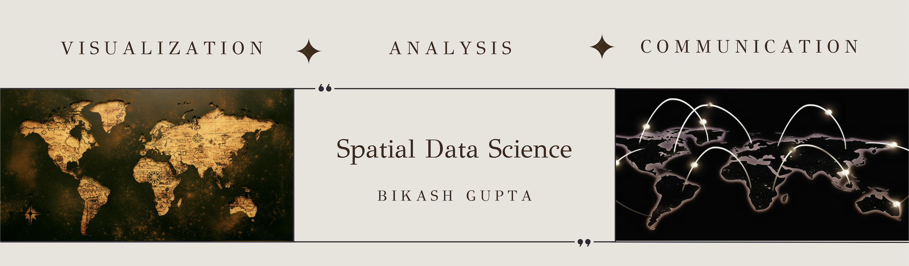

# GIS Portfolio

# About the Author

I am Bikash Gupta, a graduating second-year Master's student at Carnegie Mellon University, where I am finishing up my degree in public policy and data analytics. As a self-proclaimed data visualization enthusiast, I relish working with spatial data and uncovering relationships between variables. In my view, spatial data visualization holds an enormous potential to help guide us through complex decision-making processes in the realm of public policy.

During the spring semester of 2023, I had the privilege of enrolling in the Advanced Geographic Information Systems (GIS) course at Carnegie Mellon University. As a testament to the skills I acquired in the course, I created this portfolio that showcases my proficiency in GIS mapping and data visualization.

# Course and Skills

Welcome to my Advanced GIS portfolio, a six-week long course that allowed me to build on my previous experience in Introduction to GIS. Throughout the course, I had the chance to learn about new spatial visualization tools, including ArcGIS Insights, Google Maps, QGIS, and Mapbox. The class also delved into machine learning for predictive spatial analysis, such as using random forest to predict data at a more granular level. I found this particularly interesting and I wished I had more time to delve deeper into the available tools. 

In addition to expanding my skills with the aforementioned tools, I also gained exposure to project management skills, including writing and responding to RFPs. My overarching goal is to continue to build on my budding data skills and grow my expertise in the field of spatial analysis.

## Tools

To summarize, here are the thematic classifications of my learning in the Advanced GIS course:

Tools Consolidated or Learned/Knew About:

* Mabpox
* ArcGIS Insights
* Google Maps
* ArcGIS Dashboard 
* ArcGIS Pro
* Project management
* Writing and responding to RFP

## Areas 

Areas of Study
* Machine Learning
* Random Forest classification

# Portfolio

I worked on several short-term projects. Some of them are below

## Mapping the opioid crisis. 
You can find the data visualization [here](https://insights.arcgis.com/#/view/aa939c7bb447456cbecbe1066a327aa5)

<iframe src="https://insights.arcgis.com/#/embed/076994654a3448e186b11edbb48b500b" width="1370" height="1440" frameborder="0"></iframe>

## Global flows of refugees from 1951-2020

You can access the [visual analysis here.](https://insights.arcgis.com/#/view/076994654a3448e186b11edbb48b500b) 

<iframe src="https://insights.arcgis.com/#/embed/076994654a3448e186b11edbb48b500b" width="100%" height="100%" frameborder="0"></iframe>
