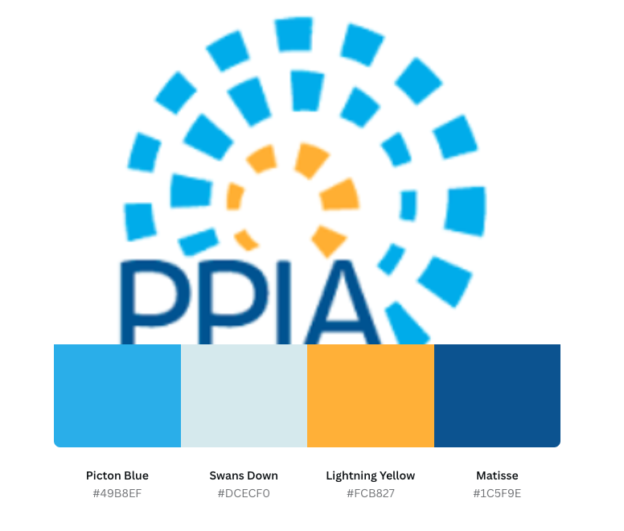
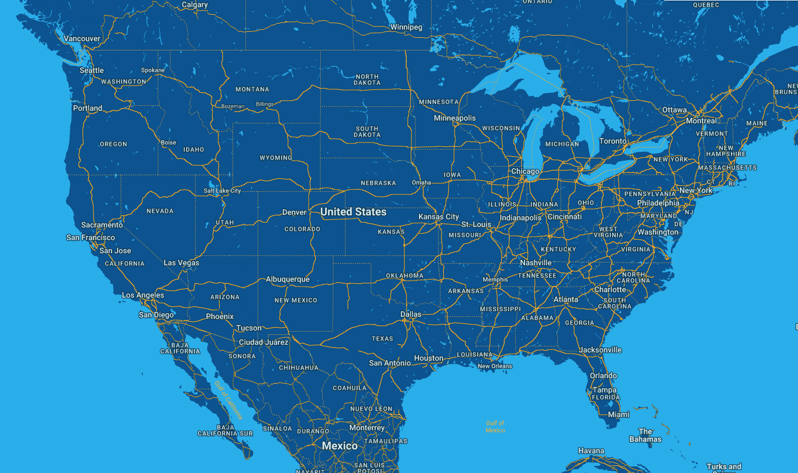
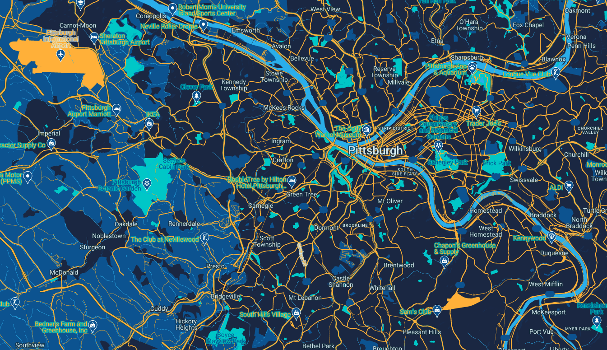

<html>

  
<body>

<h1>Public Policy and International Affairs (PPIA) Consortium Universities</h1> 

Public Policy and International Affairs is a prestigious fellowship that offers rising college seniors, particularly from marginalized communities, opportunities to study at various elite public policy colleges in the United States for their junior summer, thereby offering them the exposure in public policy and training them for careers in public offices.
  
To encourage more minority representation in the government, bureaucray, for-profit, and non-profit sectors, more universities are opening doors for students from marginalized communities. Currently, 62 colleges and universities are a part of PPIA consortium, offering scholarships to students. Heinz College at Carnegie Mellon University is one of such colleges. 
  
  <h4>Logo</h4>

There are various banners of PPIA fellowships. One of them is here: 

However, PPIA has a specific logo, which uses 4 distinct colors.

The photo was blurry, but when I uploaded on the <a href='https://www.canva.com/colors/color-palette-generator/'> canva palette generator</a>, the generator still offered us the 4 distinct colors.

The color ranges were as follows: 

<table style="width:100%">
  <tr>
    <th>Color</th>
    <th>Hexagonal Color Value</th>
  </tr>
  <tr>
    <td>Picton Blue
    <td>#49B8EF</td>
  </tr>
  <tr>
    <td>Swans Down</td>
    <td>#DCECF0</td>
  </tr>
  <tr>
    <td>Lightning Yellow</td>
    <td>#FCB827</td>
  </tr>
  <tr>
    <td>Matisse</td>
    <td>#1C5F9E</td>
  </tr>
  </table>

  <h2>Demonstrating PPIA's reach via Google Maps</h2> 
  
  My goal is to plot all the consortium's universities and colleges on the google map customized to PPIA's logo personality. To do so, I am deducing 4 distinct colors from the color palette. Here is what we get. 
  
  <h3>Color Palette</h3>
  
  We used the following image to generate palette:
  
  
  
  Here was the palette that was generated: 
  
  
  
  
  
  <h3>Maps</h3> 
  
  Here is the basemap upon which we will layer universities and campuses. 
  
  <h4>This is Zoom Level 1. More broadly capturing the distributing of PPIA's consortium's institution in the United States.</h4> 
  
  
  
  <h4>Zoom Level 2: This is at the state-level.</h4> 
  
  
  
  <h4>Zoom Level 3: This is at the city level.</h4> 
  
  
  
  
  <h3><Json File></h3> 
    
    You can access <a href='https://github.com/iambikashgupta/gis-portfolio/'> JSON codes here</a>.
    
   <a href='https://www.canva.com/colors/color-palette-generator/'>click here</a>
  
  <h3>Look Up Table</h3>
 
  You can access the look up [table](https://docs.google.com/document/d/1U1qyDIJZoNJw-hEzClXXR6GiBxCoPC1O6fI5Ar9krYM/edit?usp=sharing/).
  
  </body>
  </html>

