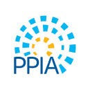

# Public Policy and International Affairs (PPIA) Consortium Universities 

<a href="https://ppiaprogram.org/">Public Policy and International Affairs</a> is a prestigious fellowship that offers rising college seniors, particularly from marginalized communities, opportunities to study at various elite public policy colleges in the United States during their summer of junior years, thereby offering them the exposure in public policy and training them for careers in public offices.
  
To encourage more minority representation in the government, bureaucray, for-profit, and non-profit sectors, more universities are opening doors for students from marginalized communities. Currently, 62 colleges and universities are a part of PPIA consortium, offering scholarships to students to pursue graduate education. Heinz College at Carnegie Mellon University is one of such colleges. 
  
### Logo

There are various banners of PPIA fellowships. One of them is here: 

However, PPIA has a specific logo, which uses 4 distinct colors.

The photo was blurry, but when I uploaded on the <a href='https://www.canva.com/colors/color-palette-generator/'> canva palette generator</a>, the generator still offered us the 4 distinct colors.

The color ranges were as follows: 

| Column 1 Color    | Column 2 Hexagonal Value |
| ----------------- | ----------------------- |
| Picton Blue       | `#49B8EF`                |
| Swans Down        | `#DCECF0`                |
| Lightning Yellow  | `#FCB827`                |
| Matisse           | `#1C5F9E`                |

  
My goal is to plot all the consortium's universities and colleges on the google map customized to PPIA's logo personality. To do so, I am deducing 4 distinct colors from the color palette. Here is what we get. 
  
### Color Palette 

  
Here was the palette that was generated: 

  
## Demonstrating PPIA's reach via Google Maps
  
### Maps 
  
Here is the basemap upon which we will layer universities and campuses. 
  
This is Zoom Level 1. More broadly capturing the distributing of PPIA's consortium's institution in the United States.
  

  
Zoom Level 2: This is at the state-level.
  

  
Zoom Level 3: This is at the city level.
  

  
  
### Json File
    
You can access <a href='https://github.com/iambikashgupta/gis-portfolio/'> JSON codes here</a>.
   
  
### Look Up Table
 
You can access the look up <a href="https://github.com/iambikashgupta/gis-portfolio/](https://docs.google.com/document/d/1U1qyDIJZoNJw-hEzClXXR6GiBxCoPC1O6fI5Ar9krYM/edit?usp=sharing/"> table</a> here. 

### Design Process and Decisions

I took the following steps to work on the project:

1. **Choosing color palette**: To tune the map closer to the PPIA's logo personality, I distilled main colors from PPIA logo via canvas.

2. **Google Maps style editor**: I went to Google Maps style editor, chose the auberigine theme, and then edited macro layers with the color palette. 

3. **Different zoom levels**: I chose three levels: the US, the state, and the city levels.

4. **Tweaking**: I went back and changed certain colors so that the map was presentable and readable.

5. **Documentation**: I copied JSON file and pasted in the Visual Studio Code, saved it to .json theme, and uploaded it back to the github page for any future reference. Secondly, I created a google document to put a Look Up reference table. Third, I created this html page. 

  

